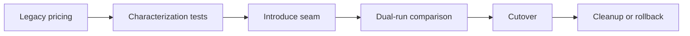

# Exercise — Refactoring Safety

## Tình huống

Legacy pricing có nhánh ngầm và side effect khiến refactor đổi behavior ngoài ý muốn. Nhóm phải cải thiện thiết kế nhưng vẫn giữ behavior đã được xác nhận.

## Nhiệm vụ

1. Chọn ba scenario rủi ro để tạo characterization tests
2. Tạo seam quanh clock/provider/global state
3. Di chuyển một nhánh mà không đổi output
4. Chạy shadow comparison và ghi mismatch

## Failure bắt buộc

Tạo test hoặc script tái hiện: **Legacy pricing có nhánh ngầm và side effect khiến refactor đổi behavior ngoài ý muốn**. Lời giải không đạt nếu chỉ chạy happy path.

## Bàn giao

- behavior inventory, seam diagram và mismatch report.
- Code/demo chạy được và tối thiểu một test failure path.
- Decision note ghi baseline, lựa chọn, trade-off và rollback.
- Trình bày 3 phút, trả lời: “khi nào giải pháp trực tiếp tốt hơn?”.

## Rubric riêng

| Tiêu chí | Điểm |
|---|---:|
| Bảo vệ đúng invariant của scenario | 25 |
| Ownership và dependency rõ | 20 |
| Failure được tái hiện và xử lý | 20 |
| Behavior inventory, seam diagram và mismatch report có thể review | 15 |
| Alternative/trade-off trung thực | 10 |
| Giải thích mạch lạc | 10 |

## Full workshop flow

### Đề bài mở rộng

Tạo characterization test cho legacy pricing trước khi tách discount rules.

### Invariant bắt buộc

Kết quả cũ phải được giữ trong giai đoạn song song, kể cả edge case đã tồn tại.

### Luồng thực hiện

### Acceptance criteria riêng

Bàn giao golden-master nhỏ, seam đầu tiên, kế hoạch rollback và danh sách behavior cố ý thay đổi.

### Câu hỏi trình bày

- Behavior nào đang được characterization test bảo vệ?
- Seam đầu tiên có nhỏ và rollback được không?
- Dual-run so sánh output nào?
- Khi nào xóa code cũ an toàn?
