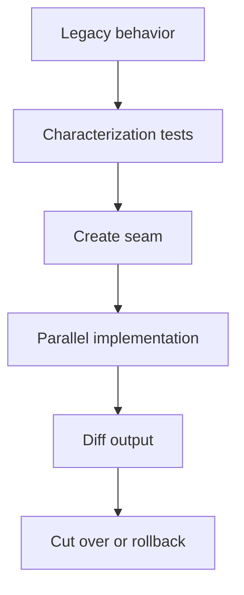

# Slides — Refactoring Safety

## Slide 1 — Outcome

- Case: Legacy pricing migration
- Invariant nào phải giữ?
- Failure nào đáng sợ nhất?

## Slide 2 — Baseline

- Trình bày code/flow trực tiếp.
- Ưu điểm: ít abstraction, dễ trace.
- Điểm gãy: Characterization test.

## Slide 3 — Mental model

## Slide 4 — Concepts

- Characterization test
- Seam
- Small step
- Dual-run
- Rollback

## Slide 5 — Refactoring journey

1. Khóa behavior bằng characterization test.
2. Tạo seam tại boundary có side effect.
3. Dual-run hoặc small-step commit để rollback được.

## Slide 6 — Failure demonstration

- Cố ý đổi behavior trong refactor và xem characterization test bắt lỗi.
- Thực hiện parallel change qua seam, giữ commit nhỏ và reversible.
- Xác định rollback point và evidence trước khi xóa code cũ.

## Slide 7 — Production checklist

- Khóa behavior bằng characterization test.
- Tạo seam tại boundary có side effect.
- Dual-run hoặc small-step commit để rollback được.
- Thu thập evidence riêng cho **Characterization-first refactoring** trước khi rollout.

## Slide 8 — Alternatives và giới hạn

- Baseline đơn giản nhất cho **Characterization-first refactoring** là gì?
- Khi nào abstraction hiện tại nên được inline hoặc thay bằng decision table/workflow trực tiếp?
- Rủi ro nào không được pattern này giải quyết?

## Slide 9 — Exercise brief

Mở [exercise.md](exercise.md), xây artifact cho **Characterization-first refactoring** và chuẩn bị trình bày: invariant, sơ đồ ownership, failure rehearsal, test evidence và rollback/revisit condition.

## Slide 10 — Exit questions

- Diff nào chứng minh behavior không đổi?
- Điểm nào cần feature flag hoặc shadow compare?
- Evidence nào sẽ khiến bạn đổi quyết định cho **Characterization-first refactoring**?

