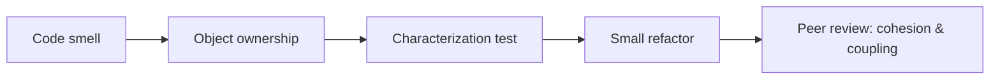
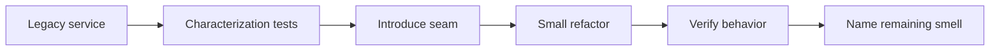

# Level: Nền tảng

## Mục tiêu

Level này dành cho **Junior → Middle**, tập trung vào object collaboration, SOLID và refactor an toàn. Sau level, học viên phải giải thích được quyết định bằng context và trade-off, chạy demo, hoàn thành exercise và phản biện một phương án thay thế.

## Luồng học

## Danh mục lesson

- [OOP và cộng tác giữa object](01-oop-and-object-collaboration/README.md)
- [SOLID trong thực tế](02-solid-in-practice/README.md)
- [Refactoring an toàn](03-refactoring-safety/README.md)

## Cách tổ chức mỗi buổi

- 15 phút: đọc code smell và xác định object ownership.
- 20 phút: mental model OOP/SOLID bằng collaboration diagram.
- 20 phút: refactor nhỏ có characterization test.
- 20 phút: pair exercise về invariant và dependency.
- 15 phút: review naming, cohesion và next action.

## Evidence hoàn thành

- Object collaboration diagram
- Characterization test trước refactor
- Một code smell và refactor nhỏ
- Reflection về abstraction chưa cần thiết

## Hướng dẫn giảng viên

Bắt đầu từ object đang ở invalid state hoặc class có nhiều lý do thay đổi. Không giới thiệu SOLID như khẩu hiệu; yêu cầu học viên chỉ ra change scenario và test chứng minh cải thiện.

## Câu hỏi kết thúc level

Học viên phải trả lời được: object nào sở hữu invariant, dependency nào nên inject, refactor nào cần characterization test và khi nào một interface chưa tạo giá trị. Giảng viên nên yêu cầu giải thích bằng code diff thay vì định nghĩa.

## Capstone của level

Học viên nhận một service đặt hàng chứa static helper, hidden dependency và nhánh điều kiện. Deliverable gồm characterization tests, dependency sketch, một refactor nhỏ có rollback và đoạn giải thích vì sao chưa cần pattern phức tạp.

Chỉ hoàn thành khi người học phân biệt được **code smell**, **nguyên tắc** và **pattern**, đồng thời chứng minh refactor không làm đổi behavior quan sát được.
