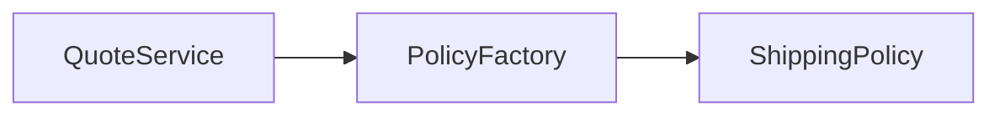

# Strategy Factory

## Bối cảnh thuyết trình

**Shipping quote engine** là case xuyên suốt. Giảng viên bắt đầu bằng code hoặc flow trực tiếp, cho học viên dự đoán failure rồi mới giới thiệu vocabulary/pattern.

## Kết quả học tập

- Strategy semantics
- Factory ownership
- Runtime selection
- Contract test
- OCP
- Giải thích trade-off và chọn baseline đơn giản hơn khi pattern chưa cần thiết.
- Trình bày test, metric hoặc artifact chứng minh thiết kế hoạt động.

## Luồng hệ thống

## Agenda 90 phút

| Phút | Hoạt động | Evidence tạo ra |
|---:|---|---|
| 0–8 | Phân tích Chọn sai shipping policy theo tenant làm báo  và chốt invariant | Một câu invariant có thể kiểm thử |
| 8–20 | Vẽ current flow và failure | Diagram có source of truth |
| 20–38 | Giải thích concept trọng tâm | policy contract, selection table và contract tests |
| 38–58 | Live coding theo safety net | Commit nhỏ, demo vẫn chạy |
| 58–73 | Failure injection | Log/output chứng minh behavior |
| 73–84 | Pair review và alternative | Trade-off note |
| 84–90 | Trình bày 3 phút | Decision + evidence + next step |
## Live coding

**Failure dùng để dẫn bài:** Chọn sai shipping policy theo tenant làm báo giá không nhất quán

1. Định nghĩa semantics của ShippingFeePolicy
2. Viết contract test cho standard và weekend
3. Đặt selection trong factory/registry tại composition boundary
4. So sánh với match expression
## Tiêu chí hoàn thành

- [ ] Định nghĩa semantics của ShippingFeePolicy.
- [ ] Viết contract test cho standard và weekend.
- [ ] Đặt selection trong factory/registry tại composition boundary.
- [ ] Nhóm bàn giao policy contract, selection table và contract tests.
- [ ] Có câu trả lời cho trường hợp không áp dụng abstraction.
## Tài liệu lesson

- [Slides của bài Strategy Factory](slides.md): mạch trình bày và sơ đồ dùng khi đứng lớp.
- [Speaker notes](speaker-notes.md): câu hỏi dẫn dắt, lỗi học viên và điểm cần nhấn mạnh cho Strategy Factory.
- [Exercise](exercise.md): bài thực hành tạo evidence cho mục tiêu của lesson.
- [Quiz và đáp án](quiz.md): kiểm tra khả năng giải thích trade-off thay vì nhớ định nghĩa.
- Demo chạy được: `php demo.php` để quan sát luồng chính và failure case của Strategy Factory.
