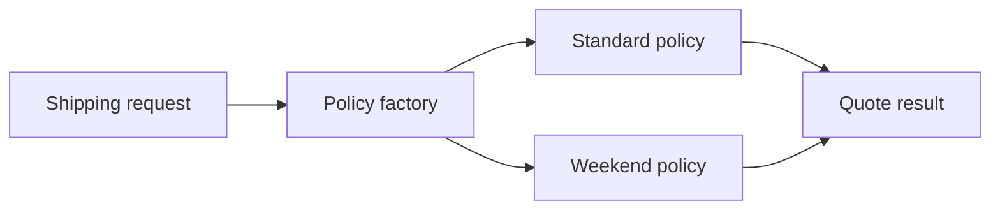

# Exercise — Strategy Factory

## Tình huống

Chọn sai shipping policy theo tenant làm báo giá không nhất quán. Nhóm phải cải thiện thiết kế nhưng vẫn giữ behavior đã được xác nhận.

## Nhiệm vụ

1. Định nghĩa semantics của ShippingFeePolicy
2. Viết contract test cho standard và weekend
3. Đặt selection trong factory/registry tại composition boundary
4. So sánh với match expression

## Failure bắt buộc

Tạo test hoặc script tái hiện: **Chọn sai shipping policy theo tenant làm báo giá không nhất quán**. Lời giải không đạt nếu chỉ chạy happy path.

## Bàn giao

- policy contract, selection table và contract tests.
- Code/demo chạy được và tối thiểu một test failure path.
- Decision note ghi baseline, lựa chọn, trade-off và rollback.
- Trình bày 3 phút, trả lời: “khi nào giải pháp trực tiếp tốt hơn?”.

## Rubric riêng

| Tiêu chí | Điểm |
|---|---:|
| Bảo vệ đúng invariant của scenario | 25 |
| Ownership và dependency rõ | 20 |
| Failure được tái hiện và xử lý | 20 |
| Policy contract, selection table và contract tests có thể review | 15 |
| Alternative/trade-off trung thực | 10 |
| Giải thích mạch lạc | 10 |

## Full workshop flow

### Đề bài mở rộng

Thiết kế shipping quote hỗ trợ standard, weekend và tenant-specific policy.

### Invariant bắt buộc

Cùng input/policy version phải cho cùng quote; factory không chứa business formula.

### Luồng thực hiện

### Acceptance criteria riêng

Có contract suite cho mọi strategy, selection table và test unknown policy.

### Câu hỏi trình bày

- Factory chọn policy dựa trên dữ liệu nào?
- Contract nào mọi shipping policy phải giữ?
- Unknown policy được xử lý ra sao?
- Khi nào match expression rõ hơn Strategy?
