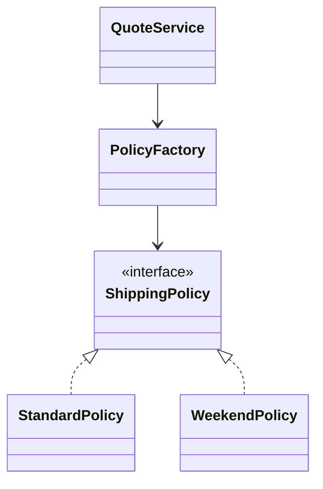

# Slides — Strategy Factory

## Slide 1 — Outcome

- Case: Shipping quote engine
- Invariant nào phải giữ?
- Failure nào đáng sợ nhất?

## Slide 2 — Baseline

- Trình bày code/flow trực tiếp.
- Ưu điểm: ít abstraction, dễ trace.
- Điểm gãy: Strategy semantics.

## Slide 3 — Mental model

## Slide 4 — Concepts

- Strategy semantics
- Factory ownership
- Runtime selection
- Contract test
- OCP

## Slide 5 — Refactoring journey

1. Định nghĩa semantics chung của ShippingPolicy.
2. Factory chỉ chọn policy; use case vẫn sở hữu workflow.
3. Contract test mọi policy với money/currency invariant.

## Slide 6 — Failure demonstration

- Cho policy selector trả sai version và quan sát quote mismatch.
- Thêm policy mới bằng contract test, không sửa use case.
- So sánh Strategy/Factory với `match` nhỏ về clarity và change cost.

## Slide 7 — Production checklist

- Định nghĩa semantics chung của ShippingPolicy.
- Factory chỉ chọn policy; use case vẫn sở hữu workflow.
- Contract test mọi policy với money/currency invariant.
- Thu thập evidence riêng cho **Shipping policy selection** trước khi rollout.

## Slide 8 — Alternatives và giới hạn

- Baseline đơn giản nhất cho **Shipping policy selection** là gì?
- Khi nào abstraction hiện tại nên được inline hoặc thay bằng decision table/workflow trực tiếp?
- Rủi ro nào không được pattern này giải quyết?

## Slide 9 — Exercise brief

Mở [exercise.md](exercise.md), xây artifact cho **Shipping policy selection** và chuẩn bị trình bày: invariant, sơ đồ ownership, failure rehearsal, test evidence và rollback/revisit condition.

## Slide 10 — Exit questions

- Khi `match` vẫn rõ hơn Factory?
- Policy version sai được phát hiện bằng signal nào?
- Evidence nào sẽ khiến bạn đổi quyết định cho **Shipping policy selection**?

