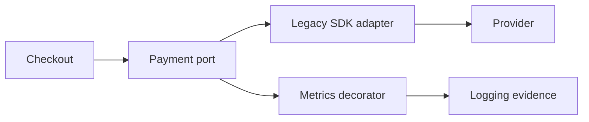

# Exercise — Adapter Decorator

## Tình huống

Provider timeout sau khi đã nhận request và wrapper retry gửi trùng notification. Nhóm phải cải thiện thiết kế nhưng vẫn giữ behavior đã được xác nhận.

## Nhiệm vụ

1. Viết target NotificationPort độc lập SDK
2. Map payload/error trong ProviderAdapter
3. Sắp thứ tự Validation, Idempotency, Retry và Logging decorator
4. Test call count khi timeout

## Failure bắt buộc

Tạo test hoặc script tái hiện: **Provider timeout sau khi đã nhận request và wrapper retry gửi trùng notification**. Lời giải không đạt nếu chỉ chạy happy path.

## Bàn giao

- wrapper order diagram và provider contract fixtures.
- Code/demo chạy được và tối thiểu một test failure path.
- Decision note ghi baseline, lựa chọn, trade-off và rollback.
- Trình bày 3 phút, trả lời: “khi nào giải pháp trực tiếp tốt hơn?”.

## Rubric riêng

| Tiêu chí | Điểm |
|---|---:|
| Bảo vệ đúng invariant của scenario | 25 |
| Ownership và dependency rõ | 20 |
| Failure được tái hiện và xử lý | 20 |
| Wrapper order diagram và provider contract fixtures có thể review | 15 |
| Alternative/trade-off trung thực | 10 |
| Giải thích mạch lạc | 10 |

## Full workshop flow

### Đề bài mở rộng

Bọc legacy payment SDK bằng stable port rồi thêm logging/metrics decorator.

### Invariant bắt buộc

Adapter phải map amount/error đúng; decorator không thay outcome hoặc retry operation không an toàn.

### Luồng thực hiện

### Acceptance criteria riêng

Test translation, wrapper order và redaction dữ liệu nhạy cảm.

### Câu hỏi trình bày

- Adapter map lỗi vendor thành lỗi nội bộ nào?
- Decorator order ảnh hưởng behavior ra sao?
- Retry có an toàn với operation payment không?
- Dữ liệu nhạy cảm được redaction ở lớp nào?
