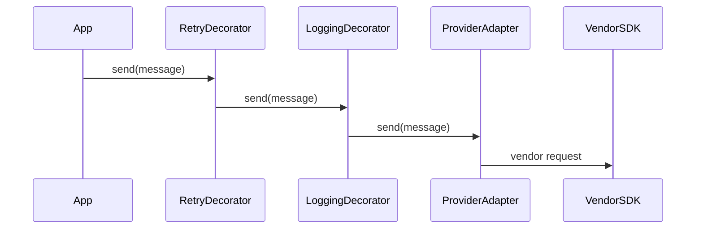

# Slides — Adapter Decorator

## Slide 1 — Outcome

- Case: Reliable external notification
- Invariant nào phải giữ?
- Failure nào đáng sợ nhất?

## Slide 2 — Baseline

- Trình bày code/flow trực tiếp.
- Ưu điểm: ít abstraction, dễ trace.
- Điểm gãy: Target contract.

## Slide 3 — Mental model

## Slide 4 — Concepts

- Target contract
- Error translation
- Decorator order
- Retry safety
- Contract test

## Slide 5 — Refactoring journey

1. Adapter dịch request/response/error của vendor.
2. Decorator order phải explicit: validate → retry → log → client.
3. Retry chỉ áp dụng cho operation idempotent.

## Slide 6 — Failure demonstration

- Cho SDK timeout sau success và kiểm tra Adapter trả `Unknown`, không `Failed`.
- Đổi thứ tự retry/idempotency decorator để quan sát duplicate side effect.
- Chốt boundary mapping và composition order bằng test call-count.

## Slide 7 — Production checklist

- Adapter dịch request/response/error của vendor.
- Decorator order phải explicit: validate → retry → log → client.
- Retry chỉ áp dụng cho operation idempotent.
- Thu thập evidence riêng cho **Vendor boundary and wrappers** trước khi rollout.

## Slide 8 — Alternatives và giới hạn

- Baseline đơn giản nhất cho **Vendor boundary and wrappers** là gì?
- Khi nào abstraction hiện tại nên được inline hoặc thay bằng decision table/workflow trực tiếp?
- Rủi ro nào không được pattern này giải quyết?

## Slide 9 — Exercise brief

Mở [exercise.md](exercise.md), xây artifact cho **Vendor boundary and wrappers** và chuẩn bị trình bày: invariant, sơ đồ ownership, failure rehearsal, test evidence và rollback/revisit condition.

## Slide 10 — Exit questions

- Wrapper order nào làm duplicate side effect?
- Contract test nào bắt vendor schema drift?
- Evidence nào sẽ khiến bạn đổi quyết định cho **Vendor boundary and wrappers**?

