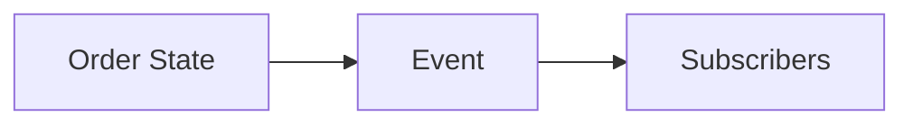

# Observer State

## Bối cảnh thuyết trình

**Order lifecycle and reactions** là case xuyên suốt. Giảng viên bắt đầu bằng code hoặc flow trực tiếp, cho học viên dự đoán failure rồi mới giới thiệu vocabulary/pattern.

## Kết quả học tập

- State transition
- Illegal transition
- Domain event
- Subscriber policy
- After-commit
- Giải thích trade-off và chọn baseline đơn giản hơn khi pattern chưa cần thiết.
- Trình bày test, metric hoặc artifact chứng minh thiết kế hoạt động.

## Luồng hệ thống

## Agenda 90 phút

| Phút | Hoạt động | Evidence tạo ra |
|---:|---|---|
| 0–8 | Phân tích Email listener lỗi làm rollback OrderPaid hoặ và chốt invariant | Một câu invariant có thể kiểm thử |
| 8–20 | Vẽ current flow và failure | Diagram có source of truth |
| 20–38 | Giải thích concept trọng tâm | state diagram, event catalog và delivery policy |
| 38–58 | Live coding theo safety net | Commit nhỏ, demo vẫn chạy |
| 58–73 | Failure injection | Log/output chứng minh behavior |
| 73–84 | Pair review và alternative | Trade-off note |
| 84–90 | Trình bày 3 phút | Decision + evidence + next step |
## Live coding

**Failure dùng để dẫn bài:** Email listener lỗi làm rollback OrderPaid hoặc duplicate event gửi hai lần

1. Vẽ state transitions hợp lệ của Order
2. Tách transition khỏi side-effect subscribers
3. Lưu event after commit qua outbox
4. Làm listener idempotent
## Tiêu chí hoàn thành

- [ ] Vẽ state transitions hợp lệ của Order.
- [ ] Tách transition khỏi side-effect subscribers.
- [ ] Lưu event after commit qua outbox.
- [ ] Nhóm bàn giao state diagram, event catalog và delivery policy.
- [ ] Có câu trả lời cho trường hợp không áp dụng abstraction.
## Tài liệu lesson

- [Slides của bài Observer State](slides.md): mạch trình bày và sơ đồ dùng khi đứng lớp.
- [Speaker notes](speaker-notes.md): câu hỏi dẫn dắt, lỗi học viên và điểm cần nhấn mạnh cho Observer State.
- [Exercise](exercise.md): bài thực hành tạo evidence cho mục tiêu của lesson.
- [Quiz và đáp án](quiz.md): kiểm tra khả năng giải thích trade-off thay vì nhớ định nghĩa.
- Demo chạy được: `php demo.php` để quan sát luồng chính và failure case của Observer State.
