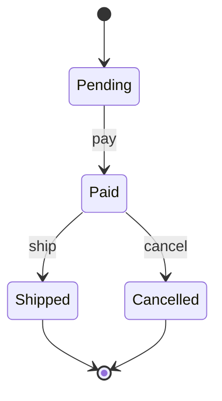

# Exercise — Observer State

## Tình huống

Email listener lỗi làm rollback OrderPaid hoặc duplicate event gửi hai lần. Nhóm phải cải thiện thiết kế nhưng vẫn giữ behavior đã được xác nhận.

## Nhiệm vụ

1. Vẽ state transitions hợp lệ của Order
2. Tách transition khỏi side-effect subscribers
3. Lưu event after commit qua outbox
4. Làm listener idempotent

## Failure bắt buộc

Tạo test hoặc script tái hiện: **Email listener lỗi làm rollback OrderPaid hoặc duplicate event gửi hai lần**. Lời giải không đạt nếu chỉ chạy happy path.

## Bàn giao

- state diagram, event catalog và delivery policy.
- Code/demo chạy được và tối thiểu một test failure path.
- Decision note ghi baseline, lựa chọn, trade-off và rollback.
- Trình bày 3 phút, trả lời: “khi nào giải pháp trực tiếp tốt hơn?”.

## Rubric riêng

| Tiêu chí | Điểm |
|---|---:|
| Bảo vệ đúng invariant của scenario | 25 |
| Ownership và dependency rõ | 20 |
| Failure được tái hiện và xử lý | 20 |
| State diagram, event catalog và delivery policy có thể review | 15 |
| Alternative/trade-off trung thực | 10 |
| Giải thích mạch lạc | 10 |

## Full workshop flow

### Đề bài mở rộng

Mô hình hóa lifecycle order và phát event sau transition thành công.

### Invariant bắt buộc

Không ship order chưa paid; subscriber nhận event một lần theo event id.

### Luồng thực hiện

### Acceptance criteria riêng

State transition table, illegal transition tests và idempotent listener demo.

### Câu hỏi trình bày

- Transition nào bị cấm và ai kiểm tra?
- Event được phát trước hay sau commit?
- Subscriber xử lý duplicate bằng key nào?
- Khi nào gọi trực tiếp rõ hơn Observer?
