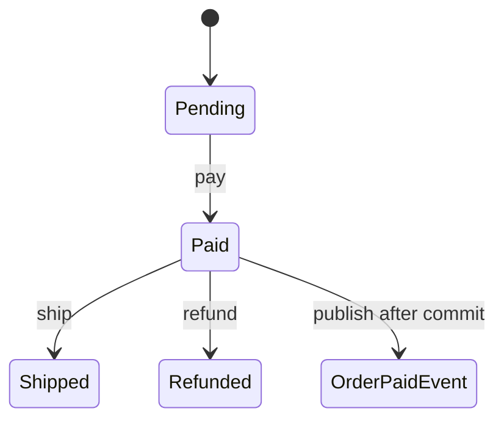

# Slides — Observer State

## Slide 1 — Outcome

- Case: Order lifecycle and reactions
- Invariant nào phải giữ?
- Failure nào đáng sợ nhất?

## Slide 2 — Baseline

- Trình bày code/flow trực tiếp.
- Ưu điểm: ít abstraction, dễ trace.
- Điểm gãy: State transition.

## Slide 3 — Mental model

## Slide 4 — Concepts

- State transition
- Illegal transition
- Domain event
- Subscriber policy
- After-commit

## Slide 5 — Refactoring journey

1. State machine từ chối illegal transition.
2. Event chỉ phát sau commit.
3. Subscriber async phải idempotent và quan sát duplicate.

## Slide 6 — Failure demonstration

- Gửi illegal transition và duplicate event.
- Quan sát state không đổi, subscriber idempotent và event chỉ phát after-commit.
- Xác định transition owner, side-effect owner và recovery owner.

## Slide 7 — Production checklist

- State machine từ chối illegal transition.
- Event chỉ phát sau commit.
- Subscriber async phải idempotent và quan sát duplicate.
- Thu thập evidence riêng cho **Order lifecycle and reactions** trước khi rollout.

## Slide 8 — Alternatives và giới hạn

- Baseline đơn giản nhất cho **Order lifecycle and reactions** là gì?
- Khi nào abstraction hiện tại nên được inline hoặc thay bằng decision table/workflow trực tiếp?
- Rủi ro nào không được pattern này giải quyết?

## Slide 9 — Exercise brief

Mở [exercise.md](exercise.md), xây artifact cho **Order lifecycle and reactions** và chuẩn bị trình bày: invariant, sơ đồ ownership, failure rehearsal, test evidence và rollback/revisit condition.

## Slide 10 — Exit questions

- Transition authority nằm ở aggregate hay listener?
- Subscriber lỗi có được rollback aggregate không?
- Evidence nào sẽ khiến bạn đổi quyết định cho **Order lifecycle and reactions**?

