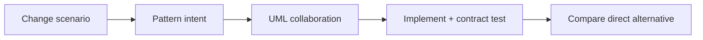
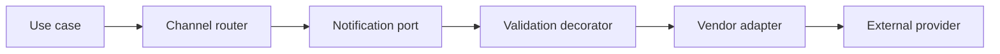

# Level: Core Patterns

## Mục tiêu

Level này dành cho **Middle**, tập trung vào Strategy, Factory, Adapter, Decorator, Observer và State. Sau level, học viên phải giải thích được quyết định bằng context và trade-off, chạy demo, hoàn thành exercise và phản biện một phương án thay thế.

## Luồng học

## Danh mục lesson

- [Strategy và Factory](01-strategy-factory/README.md)
- [Adapter và Decorator](02-adapter-decorator/README.md)
- [Observer và State](03-observer-state/README.md)

## Cách tổ chức mỗi buổi

- 10 phút: baseline `if/switch/new` và change request.
- 20 phút: UML participant cùng intent của pattern.
- 25 phút: live refactor before → after.
- 20 phút: failure/extension challenge theo nhóm.
- 15 phút: compare pattern với alternative đơn giản.

## Evidence hoàn thành

- UML participant đúng pattern
- Code + contract test cho variation
- Failure case theo pattern
- So sánh với pattern dễ nhầm

## Hướng dẫn giảng viên

Dạy pattern bằng contrast: baseline trực tiếp, pressure thực tế, pattern và trade-off. Học viên phải thêm một biến thể hoặc failure test; không chấm điểm dựa số interface.

## Điều kiện vào level

Học viên cần hiểu interface, composition, dependency injection và characterization test. Nếu chưa phân biệt được algorithm variation với lifecycle state, nên quay lại Foundations trước khi làm bài Observer/State.

## Mini-capstone

Thiết kế module giao hàng hỗ trợ Standard/Express, adapter hãng vận chuyển, decorator logging và event `ShipmentCreated`. Nộp diagram, code, test và phần giải thích pattern nào có thể bỏ để thiết kế đơn giản hơn.

## Capstone của level

Thiết kế một notification module hỗ trợ Email và Chatwork, có adapter cho SDK legacy, decorator validation/audit và strategy chọn channel. Học viên phải chỉ ra contract nào ổn định, wrapper order nào ảnh hưởng behavior và cách test vendor failure.

Rubric ưu tiên dependency direction, contract test và khả năng thêm channel mà không sửa use case. Không chấm cao chỉ vì dùng nhiều pattern.
