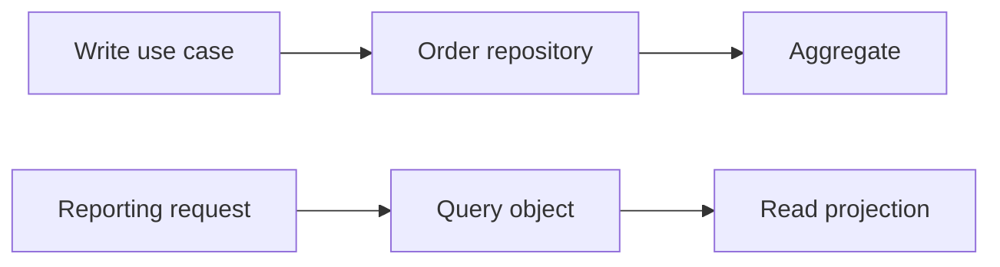

# Exercise — Repository Query Object

## Tình huống

Dùng aggregate repository cho dashboard gây N+1 và load object graph lớn. Nhóm phải cải thiện thiết kế nhưng vẫn giữ behavior đã được xác nhận.

## Nhiệm vụ

1. Định nghĩa OrderRepository theo domain intent
2. Tạo SalesReportQuery trả projection
3. Đo query count và pagination
4. Viết contract test repository

## Failure bắt buộc

Tạo test hoặc script tái hiện: **Dùng aggregate repository cho dashboard gây N+1 và load object graph lớn**. Lời giải không đạt nếu chỉ chạy happy path.

## Bàn giao

- write/read boundary map và query evidence.
- Code/demo chạy được và tối thiểu một test failure path.
- Decision note ghi baseline, lựa chọn, trade-off và rollback.
- Trình bày 3 phút, trả lời: “khi nào giải pháp trực tiếp tốt hơn?”.

## Rubric riêng

| Tiêu chí | Điểm |
|---|---:|
| Bảo vệ đúng invariant của scenario | 25 |
| Ownership và dependency rõ | 20 |
| Failure được tái hiện và xử lý | 20 |
| Write/read boundary map và query evidence có thể review | 15 |
| Alternative/trade-off trung thực | 10 |
| Giải thích mạch lạc | 10 |

## Full workshop flow

### Đề bài mở rộng

Tách aggregate write path khỏi customer reporting có cursor/filter phức tạp.

### Invariant bắt buộc

Repository bảo vệ aggregate semantics; Query Object không trả domain aggregate giả.

### Luồng thực hiện

### Acceptance criteria riêng

Test optimistic version, stable cursor và explain-plan note.

### Câu hỏi trình bày

- Repository bảo vệ aggregate semantics nào?
- Query Object cần cursor ổn định theo field nào?
- Read projection có vô tình trở thành domain object không?
- Khi nào Eloquent trực tiếp là lựa chọn tốt hơn?
