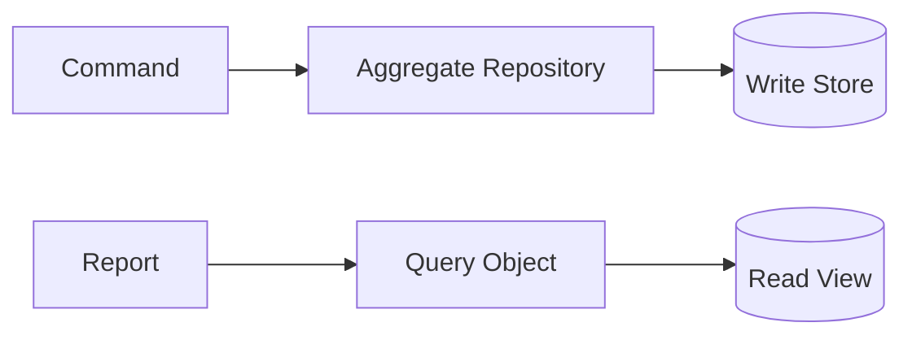

# Slides — Repository Query Object

## Slide 1 — Outcome

- Case: Customer write model and reporting
- Invariant nào phải giữ?
- Failure nào đáng sợ nhất?

## Slide 2 — Baseline

- Trình bày code/flow trực tiếp.
- Ưu điểm: ít abstraction, dễ trace.
- Điểm gãy: Aggregate repository.

## Slide 3 — Mental model

## Slide 4 — Concepts

- Aggregate repository
- Query projection
- N+1
- Pagination
- Contract test

## Slide 5 — Refactoring journey

1. Repository giữ collection semantics của aggregate.
2. Query Object tối ưu projection/pagination cho read model.
3. Không ép cùng abstraction cho read và write.

## Slide 6 — Failure demonstration

- Cố dùng aggregate repository cho report lớn và đo N+1/over-fetch.
- Tách Query Object projection, stable pagination và query-plan evidence.
- So sánh write semantics của Repository với read semantics của Query Object.

## Slide 7 — Production checklist

- Repository giữ collection semantics của aggregate.
- Query Object tối ưu projection/pagination cho read model.
- Không ép cùng abstraction cho read và write.
- Thu thập evidence riêng cho **Write aggregate vs read projection** trước khi rollout.

## Slide 8 — Alternatives và giới hạn

- Baseline đơn giản nhất cho **Write aggregate vs read projection** là gì?
- Khi nào abstraction hiện tại nên được inline hoặc thay bằng decision table/workflow trực tiếp?
- Rủi ro nào không được pattern này giải quyết?

## Slide 9 — Exercise brief

Mở [exercise.md](exercise.md), xây artifact cho **Write aggregate vs read projection** và chuẩn bị trình bày: invariant, sơ đồ ownership, failure rehearsal, test evidence và rollback/revisit condition.

## Slide 10 — Exit questions

- Query nào thật sự cần projection riêng?
- Repository có đang chỉ bọc ORM vô nghĩa?
- Evidence nào sẽ khiến bạn đổi quyết định cho **Write aggregate vs read projection**?

