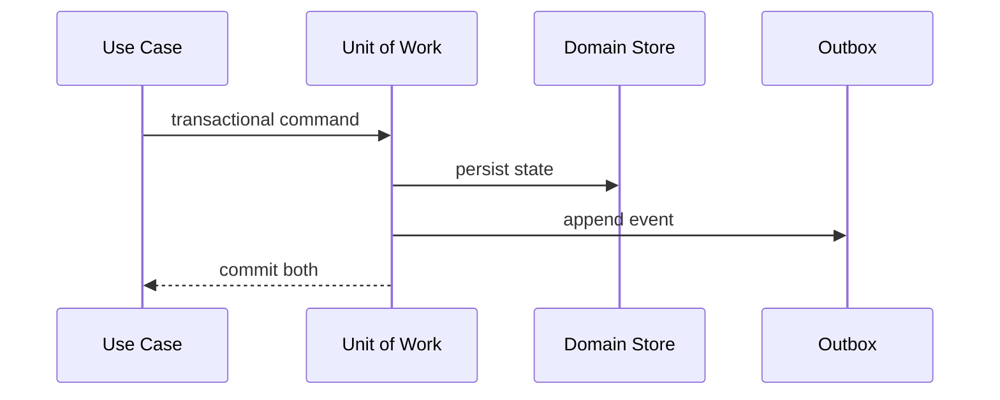

# Exercise — Unit Of Work Outbox

## Tình huống

Order commit thành công nhưng event không publish, hoặc publish lặp sau crash. Nhóm phải cải thiện thiết kế nhưng vẫn giữ behavior đã được xác nhận.

## Nhiệm vụ

1. Xác định transaction boundary của order + outbox
2. Mô phỏng rollback UnitOfWork
3. Viết publisher mark-after-send
4. Thiết kế inbox dedupe cho consumer

## Failure bắt buộc

Tạo test hoặc script tái hiện: **Order commit thành công nhưng event không publish, hoặc publish lặp sau crash**. Lời giải không đạt nếu chỉ chạy happy path.

## Bàn giao

- crash matrix, outbox sequence và reconciliation query.
- Code/demo chạy được và tối thiểu một test failure path.
- Decision note ghi baseline, lựa chọn, trade-off và rollback.
- Trình bày 3 phút, trả lời: “khi nào giải pháp trực tiếp tốt hơn?”.

## Rubric riêng

| Tiêu chí | Điểm |
|---|---:|
| Bảo vệ đúng invariant của scenario | 25 |
| Ownership và dependency rõ | 20 |
| Failure được tái hiện và xử lý | 20 |
| Crash matrix, outbox sequence và reconciliation query có thể review | 15 |
| Alternative/trade-off trung thực | 10 |
| Giải thích mạch lạc | 10 |

## Full workshop flow

### Đề bài mở rộng

Commit order cùng outbox message trong một transaction và publish lại an toàn.

### Invariant bắt buộc

Không có state commit mà thiếu event; duplicate publish không gây duplicate effect.

### Luồng thực hiện

### Acceptance criteria riêng

Crash matrix, commit/rollback tests, publisher retry và inbox dedup demo.

### Câu hỏi trình bày

- State và outbox có commit atomically không?
- Crash point nào được test?
- Publisher xử lý duplicate event thế nào?
- Khi nào transaction script đủ thay vì Unit of Work?
