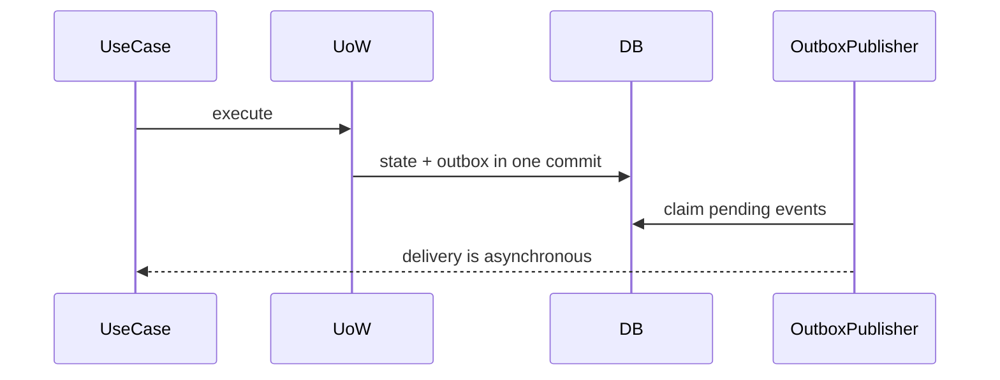

# Slides — Unit Of Work Outbox

## Slide 1 — Outcome

- Case: Atomic order and event persistence
- Invariant nào phải giữ?
- Failure nào đáng sợ nhất?

## Slide 2 — Baseline

- Trình bày code/flow trực tiếp.
- Ưu điểm: ít abstraction, dễ trace.
- Điểm gãy: Transaction boundary.

## Slide 3 — Mental model

## Slide 4 — Concepts

- Transaction boundary
- Unit of Work
- Outbox
- At-least-once
- Inbox dedupe

## Slide 5 — Refactoring journey

1. Commit aggregate và outbox trong một transaction.
2. Publisher xử lý at-least-once; consumer có inbox/dedup.
3. Reconciliation phát hiện stuck outbox.

## Slide 6 — Failure demonstration

- Mô phỏng crash trước commit, sau commit và sau broker ack.
- Quan sát rollback, pending outbox, duplicate publish và inbox dedupe.
- Xác định transaction owner, publisher lease và reconciliation owner.

## Slide 7 — Production checklist

- Commit aggregate và outbox trong một transaction.
- Publisher xử lý at-least-once; consumer có inbox/dedup.
- Reconciliation phát hiện stuck outbox.
- Thu thập evidence riêng cho **Atomic state and message** trước khi rollout.

## Slide 8 — Alternatives và giới hạn

- Baseline đơn giản nhất cho **Atomic state and message** là gì?
- Khi nào abstraction hiện tại nên được inline hoặc thay bằng decision table/workflow trực tiếp?
- Rủi ro nào không được pattern này giải quyết?

## Slide 9 — Exercise brief

Mở [exercise.md](exercise.md), xây artifact cho **Atomic state and message** và chuẩn bị trình bày: invariant, sơ đồ ownership, failure rehearsal, test evidence và rollback/revisit condition.

## Slide 10 — Exit questions

- Crash sau commit trước publish được khôi phục thế nào?
- Metric nào phát hiện backlog trước SLA breach?
- Evidence nào sẽ khiến bạn đổi quyết định cho **Atomic state and message**?

