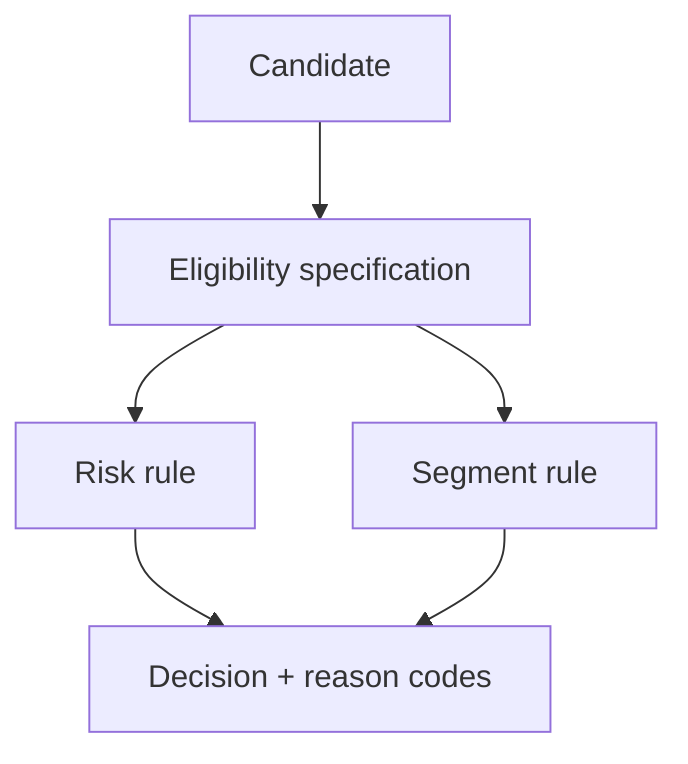

# Exercise — Specification Policy

## Tình huống

Promotion áp dụng sai vì rule compose không giải thích lý do từ chối. Nhóm phải cải thiện thiết kế nhưng vẫn giữ behavior đã được xác nhận.

## Nhiệm vụ

1. Tách eligibility predicates thành specifications
2. Compose AND/OR/NOT với short-circuit rõ
3. Trả reason codes
4. Dùng property tests cho boundary amount/date

## Failure bắt buộc

Tạo test hoặc script tái hiện: **Promotion áp dụng sai vì rule compose không giải thích lý do từ chối**. Lời giải không đạt nếu chỉ chạy happy path.

## Bàn giao

- rule tree, reason-code table và generated cases.
- Code/demo chạy được và tối thiểu một test failure path.
- Decision note ghi baseline, lựa chọn, trade-off và rollback.
- Trình bày 3 phút, trả lời: “khi nào giải pháp trực tiếp tốt hơn?”.

## Rubric riêng

| Tiêu chí | Điểm |
|---|---:|
| Bảo vệ đúng invariant của scenario | 25 |
| Ownership và dependency rõ | 20 |
| Failure được tái hiện và xử lý | 20 |
| Rule tree, reason-code table và generated cases có thể review | 15 |
| Alternative/trade-off trung thực | 10 |
| Giải thích mạch lạc | 10 |

## Full workshop flow

### Đề bài mở rộng

Xây eligibility policy cho promotion với reason code có thể giải thích.

### Invariant bắt buộc

Rule composition phải deterministic và giữ được lý do từ chối.

### Luồng thực hiện

### Acceptance criteria riêng

Truth table, property examples và test AND/OR/NOT semantics.

### Câu hỏi trình bày

- Reason code được giữ qua rule composition ra sao?
- Rule nào là domain policy, rule nào chỉ validation?
- Truth table có phủ conflicting rules không?
- Khi nào một function thuần dễ đọc hơn Specification?
