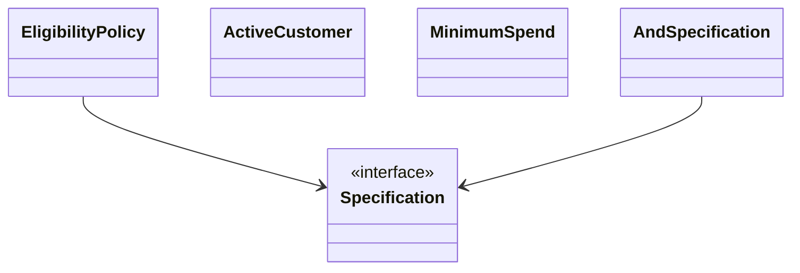

# Slides — Specification Policy

## Slide 1 — Outcome

- Case: Promotion eligibility
- Invariant nào phải giữ?
- Failure nào đáng sợ nhất?

## Slide 2 — Baseline

- Trình bày code/flow trực tiếp.
- Ưu điểm: ít abstraction, dễ trace.
- Điểm gãy: Composable predicate.

## Slide 3 — Mental model

## Slide 4 — Concepts

- Composable predicate
- Reason code
- Policy selection
- Explainability
- Property test

## Slide 5 — Refactoring journey

1. Specification trả result/reason thay vì boolean mù.
2. Tách eligibility khỏi calculation policy.
3. Property test cho rule composition và boundary values.

## Slide 6 — Failure demonstration

- Tạo hai rule xung đột và kiểm tra reason code/precedence.
- Dùng truth table hoặc property test cho composition AND/OR/NOT.
- Xác định rule nào là eligibility, rule nào là calculation policy.

## Slide 7 — Production checklist

- Specification trả result/reason thay vì boolean mù.
- Tách eligibility khỏi calculation policy.
- Property test cho rule composition và boundary values.
- Thu thập evidence riêng cho **Composable eligibility rules** trước khi rollout.

## Slide 8 — Alternatives và giới hạn

- Baseline đơn giản nhất cho **Composable eligibility rules** là gì?
- Khi nào abstraction hiện tại nên được inline hoặc thay bằng decision table/workflow trực tiếp?
- Rủi ro nào không được pattern này giải quyết?

## Slide 9 — Exercise brief

Mở [exercise.md](exercise.md), xây artifact cho **Composable eligibility rules** và chuẩn bị trình bày: invariant, sơ đồ ownership, failure rehearsal, test evidence và rollback/revisit condition.

## Slide 10 — Exit questions

- Rule order có làm thay đổi meaning không?
- Khi nào decision table đơn giản hơn object graph?
- Evidence nào sẽ khiến bạn đổi quyết định cho **Composable eligibility rules**?

