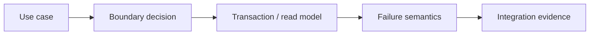
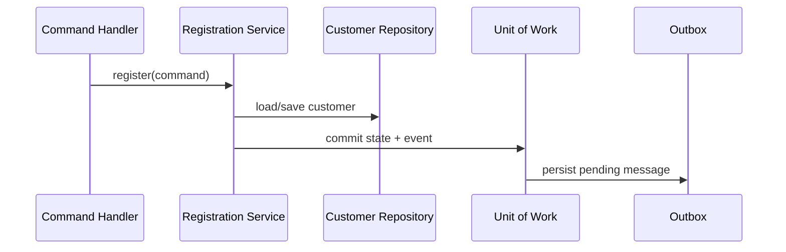

# Level: Enterprise Patterns

## Mục tiêu

Level này dành cho **Middle → Senior**, tập trung vào Repository, Query Object, Unit of Work, Outbox, Specification. Sau level, học viên phải giải thích được quyết định bằng context và trade-off, chạy demo, hoàn thành exercise và phản biện một phương án thay thế.

## Luồng học

## Danh mục lesson

- [Repository và Query Object](01-repository-query-object/README.md)
- [Unit of Work và Transactional Outbox](02-unit-of-work-outbox/README.md)
- [Specification và Policy](03-specification-policy/README.md)

## Cách tổ chức mỗi buổi

- 10 phút: use case và transaction/read requirement.
- 20 phút: boundary diagram Repository/Query/UoW/Outbox.
- 25 phút: source tour + persistence failure demo.
- 20 phút: contract/integration test workshop.
- 15 phút: review operability và migration.

## Evidence hoàn thành

- Boundary/transaction diagram
- Integration test cho persistence/messaging
- Failure recovery note
- ADR về abstraction và source of truth

## Hướng dẫn giảng viên

Đặt transaction, consistency và query semantics trước class diagram. Dùng database fixtures/crash matrix; buộc học viên giải thích source of truth và recovery path.

## Capstone đề xuất

Xây use case đặt hàng có Repository cho aggregate, Query Object cho dashboard, Unit of Work + Outbox cho atomic change và Specification cho eligibility. Nộp transaction diagram, integration tests và runbook khi publisher bị kẹt.

## Capstone của level

Xây dựng workflow đăng ký khách hàng: Service Layer điều phối, Repository lưu aggregate, Specification kiểm tra eligibility, Unit of Work ghi state và Outbox cùng transaction, Query Object trả read model. Học viên phải mô phỏng duplicate command và publish trùng.

Bài được xem là đạt khi transaction boundary, idempotency và read/write responsibility được giải thích bằng test evidence.
