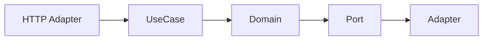

# Clean Hexagonal

## Bối cảnh thuyết trình

**Checkout core independent from Laravel** là case xuyên suốt. Giảng viên bắt đầu bằng code hoặc flow trực tiếp, cho học viên dự đoán failure rồi mới giới thiệu vocabulary/pattern.

## Kết quả học tập

- Dependency rule
- Inbound/outbound ports
- Adapters
- Composition root
- Boundary test
- Giải thích trade-off và chọn baseline đơn giản hơn khi pattern chưa cần thiết.
- Trình bày test, metric hoặc artifact chứng minh thiết kế hoạt động.

## Luồng hệ thống

## Agenda 90 phút

| Phút | Hoạt động | Evidence tạo ra |
|---:|---|---|
| 0–8 | Phân tích Use case phụ thuộc Laravel Request, Eloquent  và chốt invariant | Một câu invariant có thể kiểm thử |
| 8–20 | Vẽ current flow và failure | Diagram có source of truth |
| 20–38 | Giải thích concept trọng tâm | dependency diagram và boundary test portfolio |
| 38–58 | Live coding theo safety net | Commit nhỏ, demo vẫn chạy |
| 58–73 | Failure injection | Log/output chứng minh behavior |
| 73–84 | Pair review và alternative | Trade-off note |
| 84–90 | Trình bày 3 phút | Decision + evidence + next step |
## Live coding

**Failure dùng để dẫn bài:** Use case phụ thuộc Laravel Request, Eloquent và Facade nên không test độc lập

1. Định nghĩa input/output model của checkout use case
2. Tạo repository/payment ports
3. Viết HTTP và database adapters
4. Lắp object graph ở composition root
## Tiêu chí hoàn thành

- [ ] Định nghĩa input/output model của checkout use case.
- [ ] Tạo repository/payment ports.
- [ ] Viết HTTP và database adapters.
- [ ] Nhóm bàn giao dependency diagram và boundary test portfolio.
- [ ] Có câu trả lời cho trường hợp không áp dụng abstraction.
## Tài liệu lesson

- [Slides của bài Clean Hexagonal](slides.md): mạch trình bày và sơ đồ dùng khi đứng lớp.
- [Speaker notes](speaker-notes.md): câu hỏi dẫn dắt, lỗi học viên và điểm cần nhấn mạnh cho Clean Hexagonal.
- [Exercise](exercise.md): bài thực hành tạo evidence cho mục tiêu của lesson.
- [Quiz và đáp án](quiz.md): kiểm tra khả năng giải thích trade-off thay vì nhớ định nghĩa.
- Demo chạy được: `php demo.php` để quan sát luồng chính và failure case của Clean Hexagonal.
