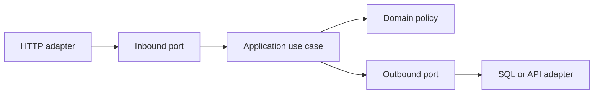

# Exercise — Clean Hexagonal

## Tình huống

Use case phụ thuộc Laravel Request, Eloquent và Facade nên không test độc lập. Nhóm phải cải thiện thiết kế nhưng vẫn giữ behavior đã được xác nhận.

## Nhiệm vụ

1. Định nghĩa input/output model của checkout use case
2. Tạo repository/payment ports
3. Viết HTTP và database adapters
4. Lắp object graph ở composition root

## Failure bắt buộc

Tạo test hoặc script tái hiện: **Use case phụ thuộc Laravel Request, Eloquent và Facade nên không test độc lập**. Lời giải không đạt nếu chỉ chạy happy path.

## Bàn giao

- dependency diagram và boundary test portfolio.
- Code/demo chạy được và tối thiểu một test failure path.
- Decision note ghi baseline, lựa chọn, trade-off và rollback.
- Trình bày 3 phút, trả lời: “khi nào giải pháp trực tiếp tốt hơn?”.

## Rubric riêng

| Tiêu chí | Điểm |
|---|---:|
| Bảo vệ đúng invariant của scenario | 25 |
| Ownership và dependency rõ | 20 |
| Failure được tái hiện và xử lý | 20 |
| Dependency diagram và boundary test portfolio có thể review | 15 |
| Alternative/trade-off trung thực | 10 |
| Giải thích mạch lạc | 10 |

## Full workshop flow

### Đề bài mở rộng

Đưa use case checkout ra khỏi controller/framework bằng inbound/outbound ports.

### Invariant bắt buộc

Domain/application không import framework; adapter lỗi được map tại boundary.

### Luồng thực hiện

### Acceptance criteria riêng

Dependency diagram, architecture test và fake adapter test.

### Câu hỏi trình bày

- Dependency nào hướng vào domain?
- Port nào phản ánh use case thay vì technology?
- Adapter failure được translate ở đâu?
- Architecture test chặn import nào?
