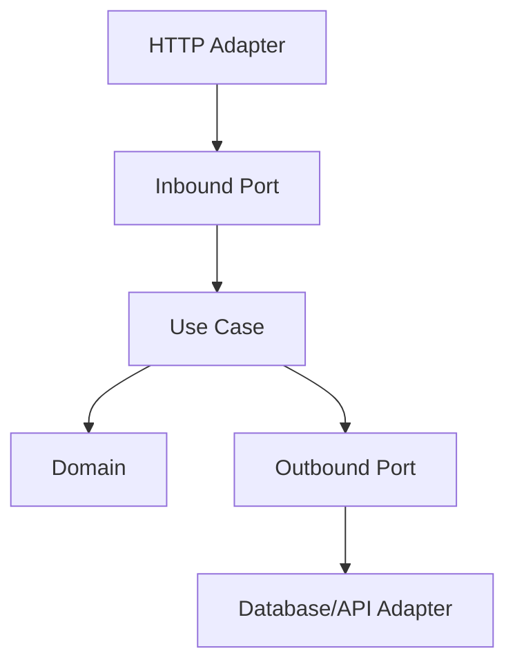

# Slides — Clean Hexagonal

## Slide 1 — Outcome

- Case: Checkout core independent from Laravel
- Invariant nào phải giữ?
- Failure nào đáng sợ nhất?

## Slide 2 — Baseline

- Trình bày code/flow trực tiếp.
- Ưu điểm: ít abstraction, dễ trace.
- Điểm gãy: Dependency rule.

## Slide 3 — Mental model

## Slide 4 — Concepts

- Dependency rule
- Inbound/outbound ports
- Adapters
- Composition root
- Boundary test

## Slide 5 — Refactoring journey

1. Use case chỉ phụ thuộc port/domain.
2. Adapter map technology error sang application error.
3. Composition root là nơi duy nhất biết concrete class.

## Slide 6 — Failure demonstration

- Cho adapter ném technical exception và kiểm tra application nhận stable error.
- Thay adapter thật bằng fake qua outbound port mà không sửa use case.
- Vẽ dependency direction và tìm framework import lọt vào domain.

## Slide 7 — Production checklist

- Use case chỉ phụ thuộc port/domain.
- Adapter map technology error sang application error.
- Composition root là nơi duy nhất biết concrete class.
- Thu thập evidence riêng cho **Dependency direction** trước khi rollout.

## Slide 8 — Alternatives và giới hạn

- Baseline đơn giản nhất cho **Dependency direction** là gì?
- Khi nào abstraction hiện tại nên được inline hoặc thay bằng decision table/workflow trực tiếp?
- Rủi ro nào không được pattern này giải quyết?

## Slide 9 — Exercise brief

Mở [exercise.md](exercise.md), xây artifact cho **Dependency direction** và chuẩn bị trình bày: invariant, sơ đồ ownership, failure rehearsal, test evidence và rollback/revisit condition.

## Slide 10 — Exit questions

- Domain có import ORM/framework không?
- Architecture test nào chặn dependency ngược?
- Evidence nào sẽ khiến bạn đổi quyết định cho **Dependency direction**?

