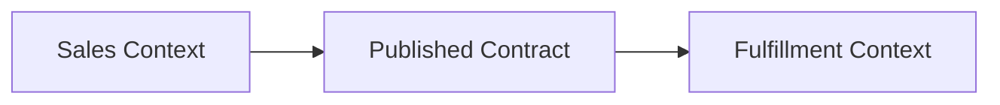

# Ddd Boundaries

## Bối cảnh thuyết trình

**Sales and Fulfillment contexts** là case xuyên suốt. Giảng viên bắt đầu bằng code hoặc flow trực tiếp, cho học viên dự đoán failure rồi mới giới thiệu vocabulary/pattern.

## Kết quả học tập

- Ubiquitous language
- Bounded context
- Aggregate
- Context map
- ACL
- Giải thích trade-off và chọn baseline đơn giản hơn khi pattern chưa cần thiết.
- Trình bày test, metric hoặc artifact chứng minh thiết kế hoạt động.

## Luồng hệ thống

## Agenda 90 phút

| Phút | Hoạt động | Evidence tạo ra |
|---:|---|---|
| 0–8 | Phân tích Sales và Fulfillment dùng chung Order model n và chốt invariant | Một câu invariant có thể kiểm thử |
| 8–20 | Vẽ current flow và failure | Diagram có source of truth |
| 20–38 | Giải thích concept trọng tâm | context map, glossary và aggregate cards |
| 38–58 | Live coding theo safety net | Commit nhỏ, demo vẫn chạy |
| 58–73 | Failure injection | Log/output chứng minh behavior |
| 73–84 | Pair review và alternative | Trade-off note |
| 84–90 | Trình bày 3 phút | Decision + evidence + next step |
## Live coding

**Failure dùng để dẫn bài:** Sales và Fulfillment dùng chung Order model nhưng hiểu status khác nhau

1. Lập glossary cho hai context
2. Xác định aggregate và invariant riêng
3. Thiết kế published contract/ACL
4. Vẽ context map có ownership
## Tiêu chí hoàn thành

- [ ] Lập glossary cho hai context.
- [ ] Xác định aggregate và invariant riêng.
- [ ] Thiết kế published contract/ACL.
- [ ] Nhóm bàn giao context map, glossary và aggregate cards.
- [ ] Có câu trả lời cho trường hợp không áp dụng abstraction.
## Tài liệu lesson

- [Slides của bài Ddd Boundaries](slides.md): mạch trình bày và sơ đồ dùng khi đứng lớp.
- [Speaker notes](speaker-notes.md): câu hỏi dẫn dắt, lỗi học viên và điểm cần nhấn mạnh cho Ddd Boundaries.
- [Exercise](exercise.md): bài thực hành tạo evidence cho mục tiêu của lesson.
- [Quiz và đáp án](quiz.md): kiểm tra khả năng giải thích trade-off thay vì nhớ định nghĩa.
- Demo chạy được: `php demo.php` để quan sát luồng chính và failure case của Ddd Boundaries.
