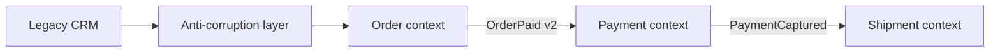

# Exercise — Ddd Boundaries

## Tình huống

Sales và Fulfillment dùng chung Order model nhưng hiểu status khác nhau. Nhóm phải cải thiện thiết kế nhưng vẫn giữ behavior đã được xác nhận.

## Nhiệm vụ

1. Lập glossary cho hai context
2. Xác định aggregate và invariant riêng
3. Thiết kế published contract/ACL
4. Vẽ context map có ownership

## Failure bắt buộc

Tạo test hoặc script tái hiện: **Sales và Fulfillment dùng chung Order model nhưng hiểu status khác nhau**. Lời giải không đạt nếu chỉ chạy happy path.

## Bàn giao

- context map, glossary và aggregate cards.
- Code/demo chạy được và tối thiểu một test failure path.
- Decision note ghi baseline, lựa chọn, trade-off và rollback.
- Trình bày 3 phút, trả lời: “khi nào giải pháp trực tiếp tốt hơn?”.

## Rubric riêng

| Tiêu chí | Điểm |
|---|---:|
| Bảo vệ đúng invariant của scenario | 25 |
| Ownership và dependency rõ | 20 |
| Failure được tái hiện và xử lý | 20 |
| Context map, glossary và aggregate cards có thể review | 15 |
| Alternative/trade-off trung thực | 10 |
| Giải thích mạch lạc | 10 |

## Full workshop flow

### Đề bài mở rộng

Tách Order, Payment và Shipment theo invariant và context language.

### Invariant bắt buộc

Không có transaction xuyên aggregate nếu không cần atomicity.

### Luồng thực hiện

### Acceptance criteria riêng

Context map, aggregate rule, integration event và ACL sketch.

### Câu hỏi trình bày

- Invariant nào quyết định aggregate boundary?
- Context nào là upstream và vì sao?
- Integration event có mang language ổn định không?
- ACL che legacy model ở điểm nào?
