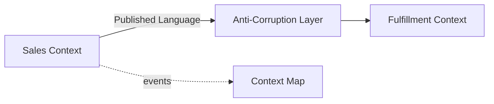

# Slides — Ddd Boundaries

## Slide 1 — Outcome

- Case: Sales and Fulfillment contexts
- Invariant nào phải giữ?
- Failure nào đáng sợ nhất?

## Slide 2 — Baseline

- Trình bày code/flow trực tiếp.
- Ưu điểm: ít abstraction, dễ trace.
- Điểm gãy: Ubiquitous language.

## Slide 3 — Mental model

## Slide 4 — Concepts

- Ubiquitous language
- Bounded context
- Aggregate
- Context map
- ACL

## Slide 5 — Refactoring journey

1. Dùng ubiquitous language để tìm boundary.
2. Aggregate chỉ bảo vệ invariant cần atomicity.
3. ACL dịch model giữa context thay vì chia sẻ entity.

## Slide 6 — Failure demonstration

- Đưa một invariant qua hai aggregate và quan sát transaction coupling.
- Vẽ context map, chọn integration contract và mô phỏng stale event.
- Xác định language owner, aggregate boundary và consistency expectation.

## Slide 7 — Production checklist

- Dùng ubiquitous language để tìm boundary.
- Aggregate chỉ bảo vệ invariant cần atomicity.
- ACL dịch model giữa context thay vì chia sẻ entity.
- Thu thập evidence riêng cho **Bounded context and aggregate** trước khi rollout.

## Slide 8 — Alternatives và giới hạn

- Baseline đơn giản nhất cho **Bounded context and aggregate** là gì?
- Khi nào abstraction hiện tại nên được inline hoặc thay bằng decision table/workflow trực tiếp?
- Rủi ro nào không được pattern này giải quyết?

## Slide 9 — Exercise brief

Mở [exercise.md](exercise.md), xây artifact cho **Bounded context and aggregate** và chuẩn bị trình bày: invariant, sơ đồ ownership, failure rehearsal, test evidence và rollback/revisit condition.

## Slide 10 — Exit questions

- Invariant nào buộc cùng transaction?
- Context map thể hiện quyền lực upstream/downstream chưa?
- Evidence nào sẽ khiến bạn đổi quyết định cho **Bounded context and aggregate**?

