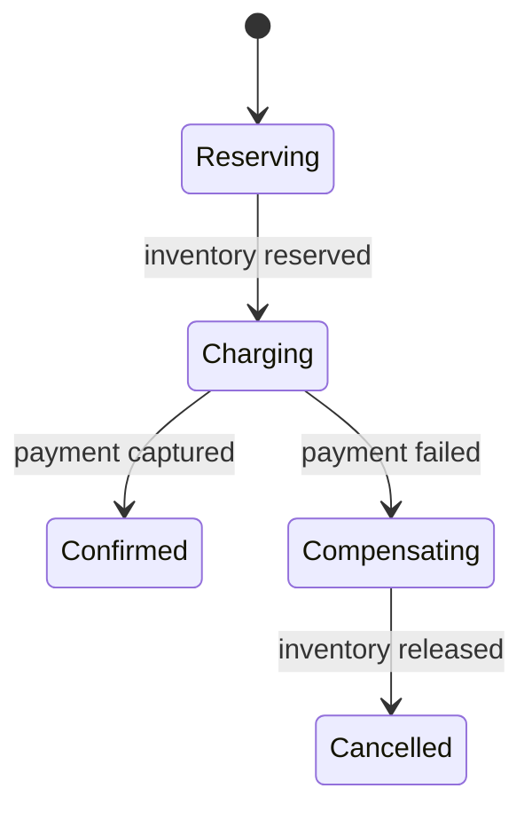

# Exercise — Microservice Consistency

## Tình huống

Payment confirmed nhưng stock reject; event đến lặp và đảo thứ tự. Nhóm phải cải thiện thiết kế nhưng vẫn giữ behavior đã được xác nhận.

## Nhiệm vụ

1. Vẽ saga/process-manager states
2. Định nghĩa idempotency key mỗi command
3. Thiết kế compensation và timeout
4. Thêm reconciliation/manual intervention

## Failure bắt buộc

Tạo test hoặc script tái hiện: **Payment confirmed nhưng stock reject; event đến lặp và đảo thứ tự**. Lời giải không đạt nếu chỉ chạy happy path.

## Bàn giao

- saga state machine, message contract và stuck-process dashboard.
- Code/demo chạy được và tối thiểu một test failure path.
- Decision note ghi baseline, lựa chọn, trade-off và rollback.
- Trình bày 3 phút, trả lời: “khi nào giải pháp trực tiếp tốt hơn?”.

## Rubric riêng

| Tiêu chí | Điểm |
|---|---:|
| Bảo vệ đúng invariant của scenario | 25 |
| Ownership và dependency rõ | 20 |
| Failure được tái hiện và xử lý | 20 |
| Saga state machine, message contract và stuck-process dashboard có thể review | 15 |
| Alternative/trade-off trung thực | 10 |
| Giải thích mạch lạc | 10 |

## Full workshop flow

### Đề bài mở rộng

Thiết kế order saga có timeout, compensation và manual escalation.

### Invariant bắt buộc

Mỗi command idempotent; workflow state phục hồi được sau restart.

### Luồng thực hiện

### Acceptance criteria riêng

Saga state diagram, duplicate/out-of-order tests và runbook stuck workflow.

### Câu hỏi trình bày

- Saga state được persist ở đâu?
- Command nào cần idempotency key?
- Timeout kích hoạt compensation hay manual review?
- Out-of-order event được xử lý theo version nào?
