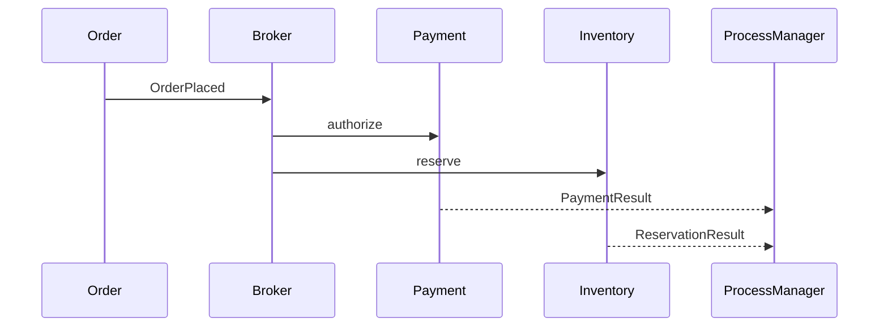

# Slides — Microservice Consistency

## Slide 1 — Outcome

- Case: Distributed order workflow
- Invariant nào phải giữ?
- Failure nào đáng sợ nhất?

## Slide 2 — Baseline

- Trình bày code/flow trực tiếp.
- Ưu điểm: ít abstraction, dễ trace.
- Điểm gãy: Local transaction.

## Slide 3 — Mental model

## Slide 4 — Concepts

- Local transaction
- Saga
- Outbox/Inbox
- Idempotency
- Reconciliation

## Slide 5 — Refactoring journey

1. Local transaction + integration event.
2. Saga lưu process state và timeout.
3. Idempotency, inbox và reconciliation là bắt buộc.

## Slide 6 — Failure demonstration

- Gửi duplicate/out-of-order event và làm compensation thất bại.
- Quan sát saga state, retry budget, timeout và manual intervention.
- Xác định source of truth, convergence proof và reconciliation owner.

## Slide 7 — Production checklist

- Local transaction + integration event.
- Saga lưu process state và timeout.
- Idempotency, inbox và reconciliation là bắt buộc.
- Thu thập evidence riêng cho **Distributed consistency** trước khi rollout.

## Slide 8 — Alternatives và giới hạn

- Baseline đơn giản nhất cho **Distributed consistency** là gì?
- Khi nào abstraction hiện tại nên được inline hoặc thay bằng decision table/workflow trực tiếp?
- Rủi ro nào không được pattern này giải quyết?

## Slide 9 — Exercise brief

Mở [exercise.md](exercise.md), xây artifact cho **Distributed consistency** và chuẩn bị trình bày: invariant, sơ đồ ownership, failure rehearsal, test evidence và rollback/revisit condition.

## Slide 10 — Exit questions

- Outcome mơ hồ được xác minh bằng query nào?
- Compensation nào không thể tự động?
- Evidence nào sẽ khiến bạn đổi quyết định cho **Distributed consistency**?

