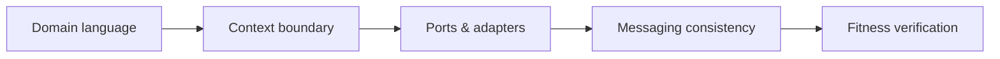
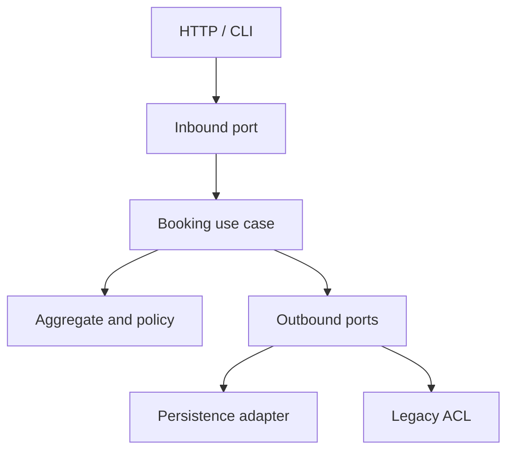

# Level: Architecture

## Mục tiêu

Level này dành cho **Senior**, tập trung vào Clean/Hexagonal, DDD boundaries và distributed consistency. Sau level, học viên phải giải thích được quyết định bằng context và trade-off, chạy demo, hoàn thành exercise và phản biện một phương án thay thế.

## Luồng học

## Danh mục lesson

- [Clean Architecture và Hexagonal Architecture](01-clean-hexagonal/README.md)
- [DDD và ranh giới Bounded Context](02-ddd-boundaries/README.md)
- [Nhất quán trong Microservices](03-microservice-consistency/README.md)

## Cách tổ chức mỗi buổi

- 15 phút: context map hoặc system failure narrative.
- 20 phút: ports/boundaries/consistency model.
- 20 phút: source + sequence diagram walkthrough.
- 20 phút: architecture scenario theo nhóm.
- 15 phút: evidence, fitness function và trade-off review.

## Evidence hoàn thành

- Context/dependency map
- Consistency và migration plan
- Fitness function hoặc architecture test
- Trade-off deployment/operations

## Hướng dẫn giảng viên

Bắt đầu bằng ranh giới ownership và failure xuyên service, không bắt đầu bằng folder structure. Yêu cầu diagram có data ownership, timing và consistency expectation.

## Capstone đề xuất

Tách một module legacy sang Ports and Adapters, xác định bounded context và thiết kế consistency giữa hai service. Nộp context map, migration plan, event contract, fitness function và rollback rehearsal.

## Capstone của level

Tách một module Booking khỏi monolith theo hướng ports-and-adapters. Học viên phải xác định aggregate boundary, anti-corruption layer, event contract và migration theo parallel change; không được bắt đầu bằng việc tạo microservice.

Evidence gồm context map, dependency rule, contract tests và rollback path. Quyết định deploy chung hay tách service phải dựa trên ownership và failure isolation.
