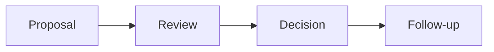

# Design Review

## Bối cảnh thuyết trình

**Review a payment proposal** là case xuyên suốt. Giảng viên bắt đầu bằng code hoặc flow trực tiếp, cho học viên dự đoán failure rồi mới giới thiệu vocabulary/pattern.

## Kết quả học tập

- Problem framing
- Alternatives
- Risk
- Evidence
- Revisit trigger
- Giải thích trade-off và chọn baseline đơn giản hơn khi pattern chưa cần thiết.
- Trình bày test, metric hoặc artifact chứng minh thiết kế hoạt động.

## Luồng hệ thống

## Agenda 90 phút

| Phút | Hoạt động | Evidence tạo ra |
|---:|---|---|
| 0–8 | Phân tích Review biến thành tranh luận style, bỏ sót in và chốt invariant | Một câu invariant có thể kiểm thử |
| 8–20 | Vẽ current flow và failure | Diagram có source of truth |
| 20–38 | Giải thích concept trọng tâm | review packet, risk register và decision log |
| 38–58 | Live coding theo safety net | Commit nhỏ, demo vẫn chạy |
| 58–73 | Failure injection | Log/output chứng minh behavior |
| 73–84 | Pair review và alternative | Trade-off note |
| 84–90 | Trình bày 3 phút | Decision + evidence + next step |
## Live coding

**Failure dùng để dẫn bài:** Review biến thành tranh luận style, bỏ sót invariant và rollback

1. Tóm tắt problem/constraints một trang
2. Liệt kê baseline và hai alternatives
3. Phân loại blocking risk với preference
4. Ghi decision, owner và follow-up evidence
## Tiêu chí hoàn thành

- [ ] Tóm tắt problem/constraints một trang.
- [ ] Liệt kê baseline và hai alternatives.
- [ ] Phân loại blocking risk với preference.
- [ ] Nhóm bàn giao review packet, risk register và decision log.
- [ ] Có câu trả lời cho trường hợp không áp dụng abstraction.
## Tài liệu lesson

- [Slides của bài Design Review](slides.md): mạch trình bày và sơ đồ dùng khi đứng lớp.
- [Speaker notes](speaker-notes.md): câu hỏi dẫn dắt, lỗi học viên và điểm cần nhấn mạnh cho Design Review.
- [Exercise](exercise.md): bài thực hành tạo evidence cho mục tiêu của lesson.
- [Quiz và đáp án](quiz.md): kiểm tra khả năng giải thích trade-off thay vì nhớ định nghĩa.
- Demo chạy được: `php demo.php` để quan sát luồng chính và failure case của Design Review.
