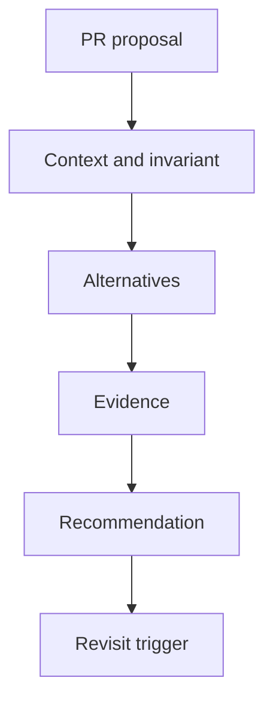

# Exercise — Design Review

## Tình huống

Review biến thành tranh luận style, bỏ sót invariant và rollback. Nhóm phải cải thiện thiết kế nhưng vẫn giữ behavior đã được xác nhận.

## Nhiệm vụ

1. Tóm tắt problem/constraints một trang
2. Liệt kê baseline và hai alternatives
3. Phân loại blocking risk với preference
4. Ghi decision, owner và follow-up evidence

## Failure bắt buộc

Tạo test hoặc script tái hiện: **Review biến thành tranh luận style, bỏ sót invariant và rollback**. Lời giải không đạt nếu chỉ chạy happy path.

## Bàn giao

- review packet, risk register và decision log.
- Code/demo chạy được và tối thiểu một test failure path.
- Decision note ghi baseline, lựa chọn, trade-off và rollback.
- Trình bày 3 phút, trả lời: “khi nào giải pháp trực tiếp tốt hơn?”.

## Rubric riêng

| Tiêu chí | Điểm |
|---|---:|
| Bảo vệ đúng invariant của scenario | 25 |
| Ownership và dependency rõ | 20 |
| Failure được tái hiện và xử lý | 20 |
| Review packet, risk register và decision log có thể review | 15 |
| Alternative/trade-off trung thực | 10 |
| Giải thích mạch lạc | 10 |

## Full workshop flow

### Đề bài mở rộng

Review một PR thêm generic repository và 12 interface cho CRUD đơn giản.

### Invariant bắt buộc

Quyết định phải dựa trên volatility/evidence, không dựa trên “best practice”.

### Luồng thực hiện

### Acceptance criteria riêng

Review packet gồm alternatives, cost, testability, deletion plan và recommendation.

### Câu hỏi trình bày

- Proposal giải quyết volatility thật hay giả định?
- Alternative đơn giản nhất đã được thử chưa?
- Evidence nào có thể bác bỏ recommendation?
- Cleanup trigger của abstraction là gì?
