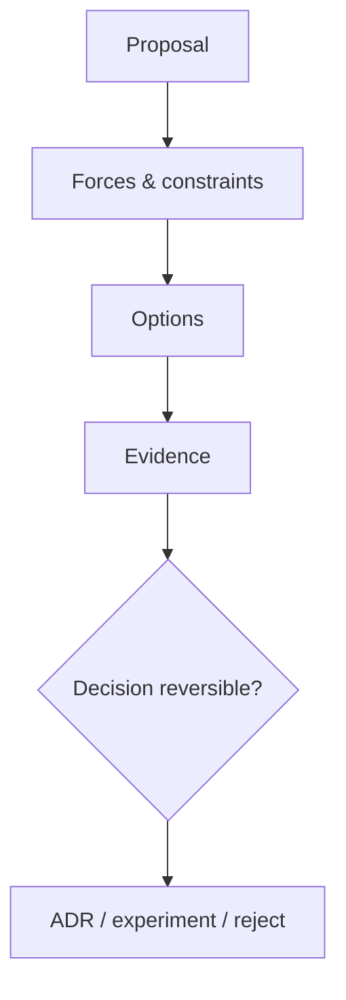

# Slides — Design Review

## Slide 1 — Outcome

- Case: Review a payment proposal
- Invariant nào phải giữ?
- Failure nào đáng sợ nhất?

## Slide 2 — Baseline

- Trình bày code/flow trực tiếp.
- Ưu điểm: ít abstraction, dễ trace.
- Điểm gãy: Problem framing.

## Slide 3 — Mental model

## Slide 4 — Concepts

- Problem framing
- Alternatives
- Risk
- Evidence
- Revisit trigger

## Slide 5 — Refactoring journey

1. Review problem/forces trước pattern name.
2. Yêu cầu baseline, alternatives và reversibility.
3. Theo dõi metric để revisit decision.

## Slide 6 — Failure demonstration

- Review một abstraction không có evidence và yêu cầu baseline/alternative.
- Tìm hidden lifecycle, transaction và failure ownership trong diagram.
- Viết comment review có risk, evidence request và action cụ thể.

## Slide 7 — Production checklist

- Review problem/forces trước pattern name.
- Yêu cầu baseline, alternatives và reversibility.
- Theo dõi metric để revisit decision.
- Thu thập evidence riêng cho **Evidence-based review** trước khi rollout.

## Slide 8 — Alternatives và giới hạn

- Baseline đơn giản nhất cho **Evidence-based review** là gì?
- Khi nào abstraction hiện tại nên được inline hoặc thay bằng decision table/workflow trực tiếp?
- Rủi ro nào không được pattern này giải quyết?

## Slide 9 — Exercise brief

Mở [exercise.md](exercise.md), xây artifact cho **Evidence-based review** và chuẩn bị trình bày: invariant, sơ đồ ownership, failure rehearsal, test evidence và rollback/revisit condition.

## Slide 10 — Exit questions

- Evidence nào đủ để approve abstraction?
- Ai sở hữu cleanup khi giả định sai?
- Evidence nào sẽ khiến bạn đổi quyết định cho **Evidence-based review**?

