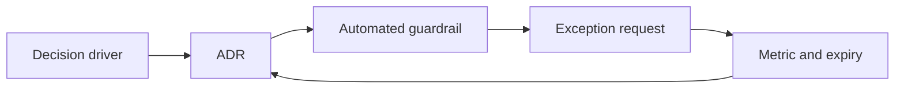

# Exercise — Adr And Governance

## Tình huống

ADR chỉ ghi “dùng best practice” và guardrail chặn use case hợp lệ. Nhóm phải cải thiện thiết kế nhưng vẫn giữ behavior đã được xác nhận.

## Nhiệm vụ

1. Viết context có forces đo được
2. So sánh ít nhất hai alternatives
3. Ghi consequence và revisit trigger
4. Chuyển một constraint thành fitness function

## Failure bắt buộc

Tạo test hoặc script tái hiện: **ADR chỉ ghi “dùng best practice” và guardrail chặn use case hợp lệ**. Lời giải không đạt nếu chỉ chạy happy path.

## Bàn giao

- ADR hoàn chỉnh, fitness rule và exception record.
- Code/demo chạy được và tối thiểu một test failure path.
- Decision note ghi baseline, lựa chọn, trade-off và rollback.
- Trình bày 3 phút, trả lời: “khi nào giải pháp trực tiếp tốt hơn?”.

## Rubric riêng

| Tiêu chí | Điểm |
|---|---:|
| Bảo vệ đúng invariant của scenario | 25 |
| Ownership và dependency rõ | 20 |
| Failure được tái hiện và xử lý | 20 |
| Adr hoàn chỉnh, fitness rule và exception record có thể review | 15 |
| Alternative/trade-off trung thực | 10 |
| Giải thích mạch lạc | 10 |

## Full workshop flow

### Đề bài mở rộng

Viết ADR chọn Outbox cho payment events và quy trình exception khi team không áp dụng.

### Invariant bắt buộc

Decision có owner, metric, rollout, revisit date và rollback trigger.

### Luồng thực hiện

### Acceptance criteria riêng

ADR hoàn chỉnh, fitness check và exception workflow.

### Câu hỏi trình bày

- Decision driver nào quan trọng nhất?
- Guardrail tự động hóa rule nào?
- Exception có owner và expiry không?
- Metric nào kích hoạt revisit ADR?
