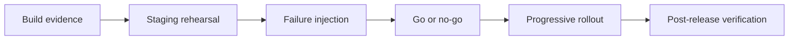

# Exercise — Production Readiness

## Tình huống

Provider migration rollout 100% gây duplicate charge và không rollback được. Nhóm phải cải thiện thiết kế nhưng vẫn giữ behavior đã được xác nhận.

## Nhiệm vụ

1. Phân loại schema/behavior/infrastructure changes
2. Thiết kế cohort rollout và stop conditions
3. Chuẩn bị dashboards, alerts và runbook
4. Diễn tập rollback/failover

## Failure bắt buộc

Tạo test hoặc script tái hiện: **Provider migration rollout 100% gây duplicate charge và không rollback được**. Lời giải không đạt nếu chỉ chạy happy path.

## Bàn giao

- go/no-go packet, rollout timeline và rollback evidence.
- Code/demo chạy được và tối thiểu một test failure path.
- Decision note ghi baseline, lựa chọn, trade-off và rollback.
- Trình bày 3 phút, trả lời: “khi nào giải pháp trực tiếp tốt hơn?”.

## Rubric riêng

| Tiêu chí | Điểm |
|---|---:|
| Bảo vệ đúng invariant của scenario | 25 |
| Ownership và dependency rõ | 20 |
| Failure được tái hiện và xử lý | 20 |
| Go/no-go packet, rollout timeline và rollback evidence có thể review | 15 |
| Alternative/trade-off trung thực | 10 |
| Giải thích mạch lạc | 10 |

## Full workshop flow

### Đề bài mở rộng

Chuẩn bị release notification routing mới bằng progressive rollout.

### Invariant bắt buộc

Có SLO, alert, rollback, reconciliation và owner trực ca.

### Luồng thực hiện

### Acceptance criteria riêng

Go/no-go checklist, dashboard mock, failure drill và post-release verification.

### Câu hỏi trình bày

- SLO nào quyết định go/no-go?
- Failure drill nào đã chạy ở staging?
- Rollback khôi phục dữ liệu hay chỉ code?
- Post-release query nào xác nhận invariant?
