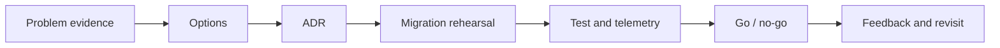

# Level: Tech Lead

## Mục tiêu

Level này dành cho **Senior → Tech Lead**, tập trung vào design review, ADR, governance và production readiness. Sau level, học viên phải giải thích được quyết định bằng context và trade-off, chạy demo, hoàn thành exercise và phản biện một phương án thay thế.

## Luồng học

## Danh mục lesson

- [Design Review cho Tech Lead](01-design-review/README.md)
- [ADR và quản trị kiến trúc](02-adr-and-governance/README.md)
- [Production Readiness](03-production-readiness/README.md)

## Cách tổ chức mỗi buổi

- 15 phút: incident/ADR/PR packet thực tế.
- 20 phút: decision drivers và governance model.
- 20 phút: calibrated review hoặc rollout rehearsal.
- 20 phút: nhóm viết ADR/runbook/fitness check.
- 15 phút: peer calibration và follow-up metric.

## Evidence hoàn thành

- Decision record có evidence
- Review rubric và coaching note
- Rollout/rollback + SLO
- Governance rule có revisit trigger

## Hướng dẫn giảng viên

Dạy bằng evidence packet và quyết định có thể đảo ngược. Người học phải review rủi ro, owner, rollout và trigger xem xét lại; tránh tranh luận theo phong cách cá nhân.

## Capstone đề xuất

Điều hành architecture review cho một thay đổi rủi ro: chuẩn bị ADR, option matrix, rollout/rollback, SLO, review rubric và coaching feedback. Đánh giá cả chất lượng quyết định lẫn cách team hiểu và vận hành nó.

## Capstone của level

Điều phối architecture review cho một thay đổi payment provider. Người học chuẩn bị ADR, risk matrix, rollout, dashboard, incident scenario và tiêu chí loại bỏ abstraction. Phần trình bày phải nêu giả định chưa biết thay vì che chúng bằng thuật ngữ pattern.

Rubric chấm correctness, reversibility, operability, communication và khả năng hướng dẫn team chọn baseline đơn giản.
